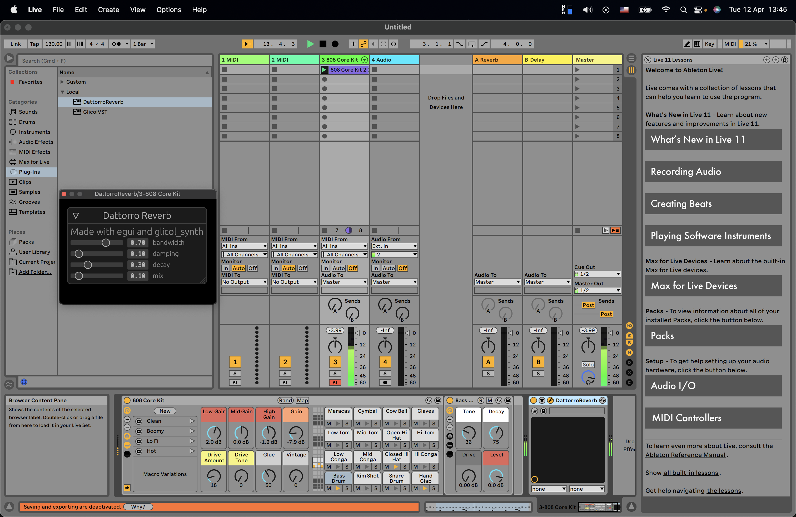

# Introduction

This repository contains the source code to build a Dattorro's Plate Reverb effect VST plugin that can be used in different DAWs such as Ableton Live, Bitwig, etc.

This is also an example of using `glicol_synth` with other Rust audio libraries.

Here's a video demo:

https://youtu.be/DLFO4dXzKsg

# Background

The GUI frontend is developed with [egui](https://github.com/emilk/egui).

The audio engine is written with [glicol_synth](https://github.com/chaosprint/glicol).

The template is from:

https://github.com/DGriffin91/egui_baseview_test_vst2

Also check the projects behind the template if you are interested:

https://github.com/BillyDM/egui-baseview

https://github.com/RustAudio/vst-rs

Thanks for all the contributors in the relevant projects. Without them, developing VST in Rust would not be so straightforward.

# Usage

You can download it directly for your music making, or you can build from the source code with some requirement.

> Currently, this plugin has only been tested on Apple computers (both M1 or Inter models).

Update:

> It also works on Windows, although the GUI does not have hi-res.

## Download

See the latest release page:

https://github.com/chaosprint/dattorro-vst-rs/releases

## Build from source code

If you are interested in Rust audio, congradulations. It is really a joy to code with Rust in almost all aspects.

### Step 1

First, you need to have rust compiler on your computer.

Make sure you can run `cargo -V` and `rustup -V` from your terminal.

### Step 2

Run the following commands from your Mac's Terminal:

- `git clone https://github.com/chaosprint/dattorro-vst-rs.git`
- `cd dattorro-vst-rs`
- `sudo zsh scripts/build.sh`

On Windows:

- Run `cargo build --release` on Terminal
- Copy `target/release/dattorro_vst_rs.dll` to your VST plugin folder

If everything goes well, then you are ready to go.

### Step 3

Open your DAW.

> If you use an M1 mac, make sure you run the DAW with Rosetta.

Then try to find the VST plugin. For Ableton Live, here's a guide:

https://help.ableton.com/hc/en-us/articles/209068929-Using-AU-and-VST-plug-ins-on-Mac

> If there's some security warning such as `cannot open`, go to your Mac's `System Preferences`, `Security & Privacy`, and then click `Open anyway`.

Then, you can just use the plugin!

# Contribution

Issue report or PR are welcomed.

You may also consider contributing to the origin template:
https://github.com/DGriffin91/egui_baseview_test_vst2

It's a gain control, which is much easier to understand.